# Architecture

The Mocha architecture contains two crossbars.<!-- ibyb3i_x -->
One crossbar is 64-bit width and is meant for the main memory.<!-- iiu1i5_x -->
The other crossbar is uncached and meant to contain the peripherals.<!-- e16ysv_x -->
Because most of these peripherals are imported from OpenTitan, in the first instance this bus is implemented as a TileLink Ultra-Lightweight bus with 32-bit width.<!-- ch8b58_x -->

<!-- m00a78_x -->

## Clock domains

There are three clock domains in Mocha.<!-- rfj4pd_x -->

1. Main: The main clock domain is the high-speed clock domain that runs the CVA6 core as well as the AXI crossbar it connects to, the AXI tag controller, debug module and the SRAM.<!-- yj8kx5_x -->
2. IO: The IO clock drives most of the peripherals and runs at a lower speed than the main clock.<!-- xe90jz_x -->
   It drives the TileLink bus and most of the peripherals that are connected to it like the UART and the SPI device.<!-- 4vkzbx_x -->
3. AON: The always on clock is also a low-speed clock with the difference being that it is always on.<!-- s61dxh_x -->
   Both the main and IO clocks can be disabled and are turned off when a system reset is requested.<!-- 68url6_x -->
   The always on clock drives the clock, reset and power managers and allows the system to come out of reset.<!-- w5ylk6_x -->

## Reset domains

Mocha has two power domains, `Aon` and `Main`, and the reset manager derives the chip's resets from them.<!-- 9g9uej_x -->
The JTAG TAP reset is the exception: `dm_jtag_trst_n` comes straight from a pin and does not pass through the reset manager.

The reset manager builds three trees.<!-- 3yv1wh_x -->

1. POR: `por_aon` is the root, driven from the top-level `rst_ni` input, and `por` and `por_io` are derived from it for the main and IO clocks.<!-- qpdwd4_x -->
2. Life cycle: `lc_src` parents the `main`, `aon`, `io`, `spi_device`, `spi_host` and `i2c` leaf resets.<!-- 44pvix_x -->
3. System: `sys_src` parents the `debug` leaf reset.<!-- 6waem2_x -->

`sys_src` has a single leaf reset, `debug`, so that the debug module survives a non-debug-module reset.
A non-debug-module request always asserts `lc_src`, but only asserts `sys_src` while `lc_hw_debug_en` is false.
However, Mocha wires `lc_hw_debug_en` to a constant `On`, so everything on `lc_src` resets and the debug module stays out of reset.

The reset manager supports four hardware reset requests: a main power glitch from the power manager, an escalation from the alert handler, a non-debug-module reset from the debug module, and an external peripheral request.
Only the non-debug-module request is connected in Mocha; the other three are tied off at the power manager instantiation in `top_chip_system.sv`.
Software can also reset the whole system by writing the reset manager's `RESET_REQ` register, which the reset manager forwards to the power manager.
Unlike a non-debug-module request this asserts both `lc_src` and `sys_src`, so the debug module resets too, and the register self-clears when the reset is acknowledged so the system does not reset repeatedly.

Software can directly control three of the leaf resets, all on the IO clock: `spi_device`, `spi_host` and `i2c`.<!-- ih9zw0_x -->
Each has its own `SW_RST_CTRL_N` register, driven straight into the leaf, holding that one peripheral in reset while the rest of the chip keeps running, so unlike a `RESET_REQ` write they do not involve the power manager and do not self-clear.
The remaining leaf resets are not software controllable.<!-- 9wq9ze_x -->
The vendored [theory of operation](../../hw/top_chip/ip_autogen/rstmgr/doc/theory_of_operation.md) describes the reset trees and their behaviour correctly, but it is written for the OpenTitan configuration and differs from Mocha, mainly:<!-- skwcio_x -->

1. It says the power-on reset is driven by AST; Mocha has no AST block, so the reset manager takes its power-on reset from `rst_ni`, an input to the Mocha enclave.
2. It lists the OpenTitan set of software resettable blocks, which includes `usbdev`. Mocha has no USB device.
3. It names `sysrst_ctrl` and `aon_timer` as peripherals capable of requesting a reset. Neither exists in Mocha.
4. It says `ALERT_INFO` and `CPU_INFO` record the alert status and CPU state before a reset. Mocha ties the alert and CPU dump inputs off, so neither register ever captures anything meaningful.

## Memory map

This is the current memory map for Mocha, where the base and top addresses are inclusive, and reserved is the amount of memory reserved for this function:<!-- mcbp27_x -->

<!-- BEGIN generated memory map -->
| Base address | Top address | Reserved   | Function      |
|--------------|-------------|------------|---------------|
| 0x00080000   | 0x00087fff  | 32.0 kiB   | ROM           |<!-- tm13gh_x -->
| 0x10000000   | 0x1001ffff  | 128.0 kiB  | SRAM          |<!-- lhfz6r -->
| 0x20000000   | 0x2000ffff  | 64.0 kiB   | DEBUG_MODULE  |<!-- sgfpp0_x -->
| 0x20010000   | 0x2001ffff  | 64.0 kiB   | MAILBOX       |<!-- z1bwrt_x -->
| 0x20020000   | 0x2002ffff  | 64.0 kiB   | DV_SW_IFC     |<!-- u122px_x -->
| 0x30000000   | 0x30007fff  | 32.0 kiB   | ETHERNET      |<!-- 2z3zns_x -->
| 0x40000000   | 0x4000ffff  | 64.0 kiB   | GPIO          |<!-- l5wm3d_x -->
| 0x40020000   | 0x4002ffff  | 64.0 kiB   | CLKMGR        |<!-- zuyj1v_x -->
| 0x40030000   | 0x4003ffff  | 64.0 kiB   | RSTMGR        |<!-- n2dywn_x -->
| 0x40040000   | 0x4004ffff  | 64.0 kiB   | POWER_MANAGER |<!-- vtnnyw_x -->
| 0x40050000   | 0x4005ffff  | 64.0 kiB   | ROM_CTRL      |<!-- ov4jpa_x -->
| 0x40060000   | 0x4006ffff  | 64.0 kiB   | ENTROPY_SRC   |<!-- s8gkf4_x -->
| 0x41000000   | 0x4100ffff  | 64.0 kiB   | UART          |<!-- heoi9y_x -->
| 0x42000000   | 0x4200ffff  | 64.0 kiB   | I2C           |<!-- 94u3qu_x -->
| 0x43000000   | 0x4300ffff  | 64.0 kiB   | SPI_DEVICE    |<!-- vniczf_x -->
| 0x44000000   | 0x4400ffff  | 64.0 kiB   | TIMER         |<!-- gjk3vu_x -->
| 0x45000000   | 0x4500ffff  | 64.0 kiB   | SPI_HOST      |<!-- jkyz51_x -->
| 0x48000000   | 0x4c004003  | 64.0 MiB   | PLIC          |<!-- pfftm1_x -->
| 0x80000000   | 0xbf7fffff  | 1016.0 MiB | DRAM          |<!-- 04smz7_x -->
<!-- END generated memory map -->

## Top-level interface

The Mocha top will need a few top-level inputs.<!-- i7mqt7_x -->
Some of these are listed here:<!-- 1cwb13_x -->
- Clock outputs from PLLs.<!-- p4bt5a_x -->
- Rollback counter backed by OTP.<!-- 7215fb_x -->
- Debug and design for test enable pins.<!-- 5fh61t_x -->
- True random noise source to drive the entropy source.<!-- 8u3w8m_x -->
- AXI subordinate port to connect to the mailbox.<!-- fna4to_x -->

In terms of output, the top-level will need output signals:<!-- tvdygx_x -->
- Key to provide an AES engine outside of the secure enclave with the memory encryption key.<!-- fv7l7k_x -->
- AXI manager port to interact with the rest of the chip.<!-- du1glx_x -->

## CVA6-CHERI

Mocha will instantiate CVA6-CHERI.<!-- t7q0t4_x -->
This is specified in [cva6-cheri.md][cva6-cheri-spec].<!-- v78vdz_x -->

## SRAM specification

The static random-access memory (SRAM) in CHERI Mocha is mainly used as the stack and heap for the boot firmware that lives in the read-only memory (ROM).<!-- 21k32t_x -->
However, it should also be possible to execute from SRAM.<!-- lhjkel -->
Once code starts executing from dynamic random-access memory (DRAM), we don't envision using SRAM anymore.<!-- a3l94p_x -->

The SRAM block has four ports:<!-- qohtih -->
- Clock input<!-- 947rwh -->
- Reset input<!-- rrni5j -->
- AXI4 request input from the main SoC sub-system crossbar<!-- pgo845 -->
- AXI4 response output back to the main crossbar<!-- n5txiq -->

Inside the block it translates the AXI4 requests into an SRAM interface that our primitive RAM wrappers use.<!-- vknoin -->
It needs to support AXI4 protocol including:<!-- mcykq8 -->
- Bursts, where the last signal must be indicated correctly.<!-- o02amt -->
- Response must have the same AXI4 ID as the request<!-- 4t4cew -->
- Atomic support is *excluded*. An atomic accesses should return an error.<!-- bsi4rc -->
- The data width is 64 bits.<!-- jeluga -->
- The address range and size of the SRAM are defined in the [memory map](#memory-map). For accesses outside this range, the xbar must return a decode error (DECERR), including if only part of the burst is outside the memory range.<!-- u0s8nt -->
- Responses must return within a bounded amount of time that may be proportional to the length of the burst.<!-- 34ld5i -->
- Only aligned 64-bit accesses are allowed.<!-- lfcb7q -->

There needs to be 1 CHERI tag bit per 128-bit aligned region.<!-- 01skcc -->
A tag should only be set to 1 by writing a full 128-bit aligned region.<!-- 8rlwol -->
This 128-bit aligned transaction must be part of a single burst.<!-- 35vdeg -->
The CHERI tag bits are communicated through a single user bit per AXI4 flit (`wuser` and `ruser` for writes and reads respectively).<!-- u95b14 -->
There should be an assertion to notify when writes occur where `wuser` is set to 1 which is not part of a full capability write.<!-- bj8we7 -->
There should also be an assertion for `wuser` mismatches, where one part of the capability is marked as valid while another is invalid in the same transaction.<!-- 9a3xf6 -->
If a portion of the 128-bit aligned region is written it must clear the tag for the whole region including when a partial write strobe is used.<!-- 893tz4 -->

Reads that only read part of a 64-bit value are allowed from valid capability regions, but these reads should have their tag cleared in the response.<!-- raa5pw -->
These reads do not modify the state of the tag in memory.<!-- 832lpx -->
Burst reads from the SRAM must have the appropriate CHERI tags set for each address, so a valid capability must have the user bits set for both of the 64-bit flits it is being sent back, and a mixture of capability and non-capability data is allowed in a burst.<!-- kn6exz -->
The SRAM is allowed to mark a capability as invalid by setting one or both of the `ruser` bits to zero, so the core must AND the two `ruser` values together to determine the validity of a capability.<!-- af8sx6 -->
Tags should be stored in a separate block of memory from the data, this is to allow future optimisations where bulk-reads of tags are desired.<!-- lzoy40 -->

The initial value of the SRAM including the tags is undefined at start-up.<!-- hqbiau -->

[cva6-cheri-spec]: ./cva6-cheri.md
