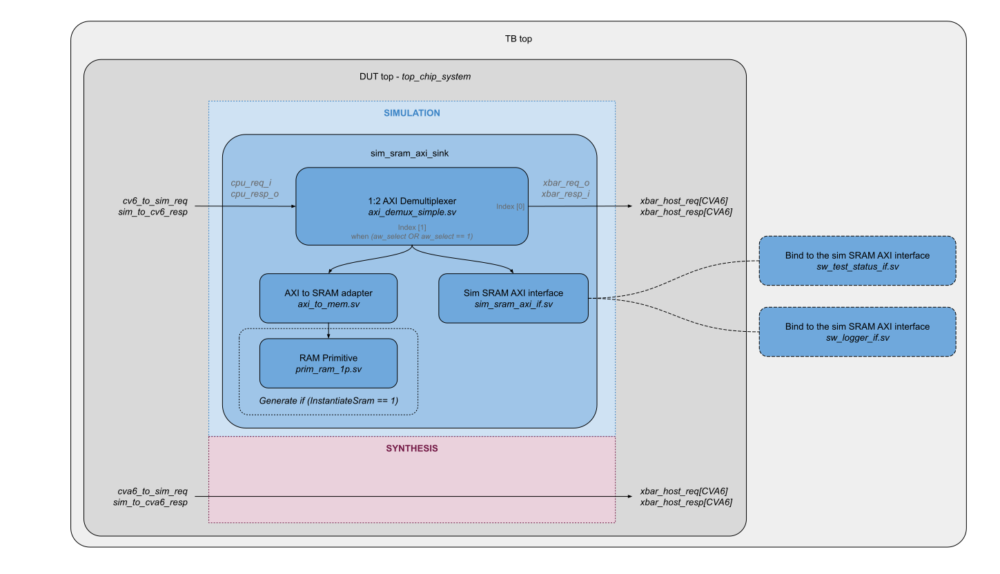

<!--
Copyright lowRISC contributors (COSMIC project).
Licensed under the Apache License, Version 2.0, see LICENSE for details.
SPDX-License-Identifier: Apache-2.0
-->

# Simulation SRAM AXI

The `sim_sram_axi_sink` module is a plain AXI subordinate that provides a chunk of "fake" memory used for simulation purposes only.
It is attached to the `SwDvWindow` device port of the main AXI crossbar inside `top_chip_system` - a dedicated, first-class entry in the crossbar's address map - so it only ever sees traffic the crossbar has already routed to that range.

It has 3 interfaces - clock, reset, and a single AXI slave port (`axi_req_i` and `axi_resp_o`) fed exclusively by the crossbar's `SwDvWindow` device.

If the user chooses to instantiate an actual SRAM instance (`InstantiateSram=1`), the AXI interface is connected to the AXI to SRAM adapter `axi_to_mem` which converts the AXI access into a SRAM access.
The [technology-independent](../../../ip/prim/README.md) `prim_ram_1p` module is used for instantiating the memory.



This module is not meant to be synthesized.
Though it is written with the synthesizable subset of SystemVerilog to be Verilator-friendly, it creates a simulation-only "hole" in the memory map.

The most typical usecase for this module is for a SW test running on an embedded CPU in the design to be able to exchange information with the testbench.
In DV, this is envisioned to be used for the following purposes:
- Write the status of the SW test.
- Use as a SW logging device (bypassing slow UART).
- Write the output of an operation.
- Signal an event to the UVM environment.

These usecases apply to Verilator as well.
However, at this time, the Verilator based simulations rely on the on-device UART for logging.

This module is attached as a subordinate device on the main AXI crossbar via the dedicated `SwDvWindow` port, so its position in the design is fixed by the crossbar's address map rather than by where it is instantiated.

## Customizations

`sim_sram_axi_sink` exposes the following parameters:

- `InstantiateSram` (default: 0):

  Controls whether to instantiate the SRAM or not.
  The most typical (and recommended) operating mode is for the SW test to only write data to this SRAM, to make it portable across various simulation platforms (DV, Verilator, FPGA etc.).
  The testbench can simply probe the sinked output of the socket to monitor writes to specific addresses within this range.
  So, in reality, the actual SRAM instance is not needed for most cases.

  However, it does enable the possibility of having a testbench driven SW test control (the SW test can read the contents of the SRAM to know how to proceed) for tests that are custom written for a particular simulation platform.
  Enabling this parameter (`1`) allows the SW test to *read* back data, enabling handshaking between the SW and the testbench without using any on-chip resources. This is particularly useful for Verilator or FPGA-based emulation where UVM monitoring is not available.

- `SramDepth` (default: 8):

  Depth of the SRAM in bus words.

- `ErrOnRead` (default: 1):

  If the SW test reads from the SRAM, trigger an assertion error. This ensures the SW treats this region as "Write-Only" logging memory, improving portability to platforms where the Sim SRAM does not exist.

## Integration and Verification Interfaces

The `sim_sram_axi_sink` serves as the physical anchor for Verification Interfaces that sniff the traffic.

In addition, the module instantiates the `sim_sram_axi_if` interface to allow the testbench to control the `start_addr` and the `sw_dv_size` of the SRAM (defaults to 0) at run-time by hierarchically referencing them, e.g.:
```systemverilog
  // In top level testbench which instantiates the `sim_sram_axi_sink`:
  initial tb.dut.u_sim_sram.u_sim_sram_if.start_addr = 32'h3000_0000;
  initial tb.dut.u_sim_sram.u_sim_sram_if.sw_dv_size = 32'h0000_0080;
```

The module instantiates `sim_sram_axi_if`, which exposes `req` and `resp` signals capturing the redirected AXI transactions.
These signals are used to generate the `wr_valid` signal, qualifying valid AXI write accesses made to the simulation SRAM range.

In the Testbench Top (`tb.sv`), higher-level verification interfaces are `bind`-ed to this signal and their virtual handle is added into the `uvm_config_db`:
1.  **`sw_test_status_if`**: Monitors writes to `SW_DV_TEST_STATUS_ADDR` to detect if the test Passed or Failed.
2.  **`sw_logger_if`**: Monitors writes to `SW_DV_LOG_ADDR` to capture `printf` characters and display them in the simulation log.

## Usage

`sim_sram_axi_sink` is instantiated purely in the testbench, never in synthesizable RTL, so design sources never depend on or instantiate simulation components.

Isolation from the design is achieved at the crossbar level rather than by cutting and forcing signals:
- `top_pkg.sv` reserves `SwDvWindow` as a first-class device on the main AXI crossbar inside `top_chip_system`, with its own fixed base address and length.
- `top_chip_system` exposes that device directly as a chip-level port pair, `sw_dv_req_o`/`sw_dv_resp_i`, alongside the other chip-level AXI ports (DRAM, rest-of-chip, etc).
- Each testbench top (`tb.sv` for UVM/DV, `top_chip_verilator.sv` for Verilator) connects `sim_sram_axi_sink` to that port pair as a plain AXI subordinate.

Because the crossbar - not the sink - decides which traffic reaches this module, no `ifdefs`, forces, or synthesis-only disconnection tricks are needed, and the same connection method works identically for UVM and Verilator.
